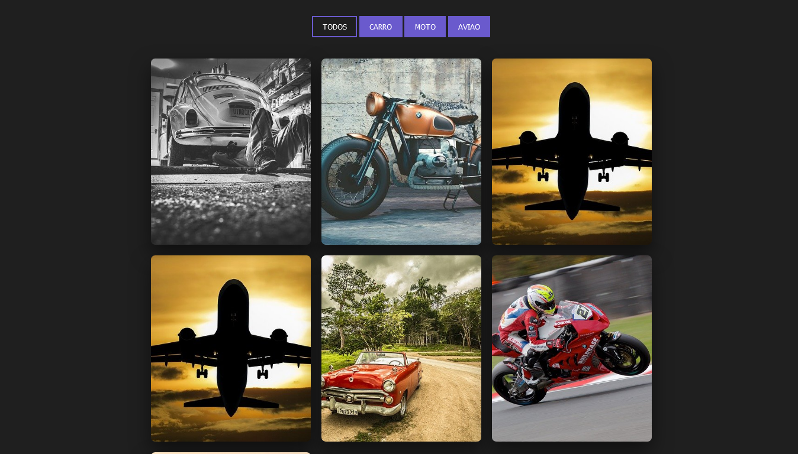

<h1 align=" center"> 
    Filtro de galeria 🎈
</h1>

<h1>
    
</h1>

<h2 align="center">
    <a href="https://matheusnlourenco.github.io/project-js-filtergalery/">Ver projeto</a>
</h2>
<h2>🚨 Sobre </h2>

Projeto simples de um filtro de galeria.

<h2>🔨 Ferramentas </h2>

- HTML
- CSS
- JAVASCRIPT
